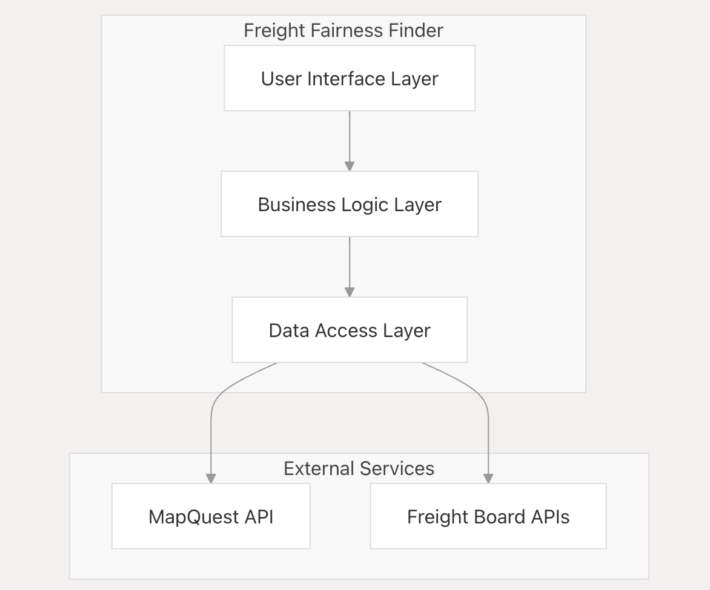
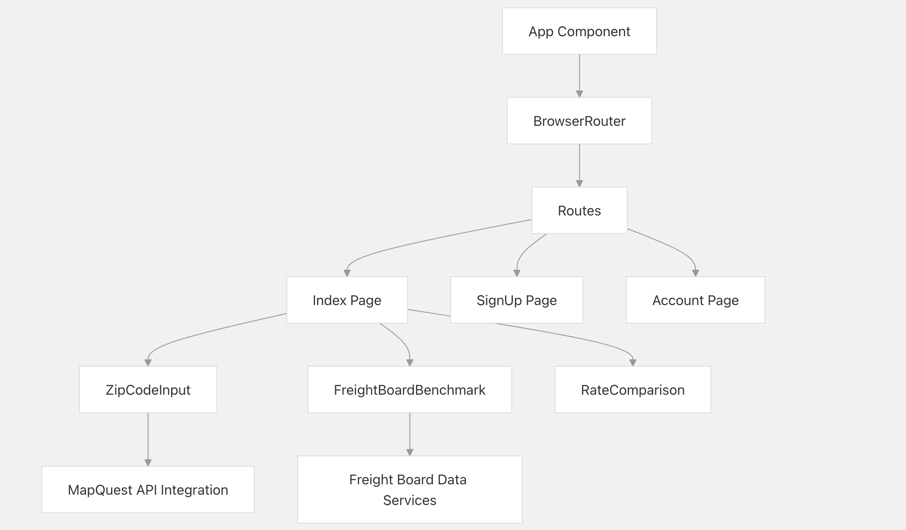
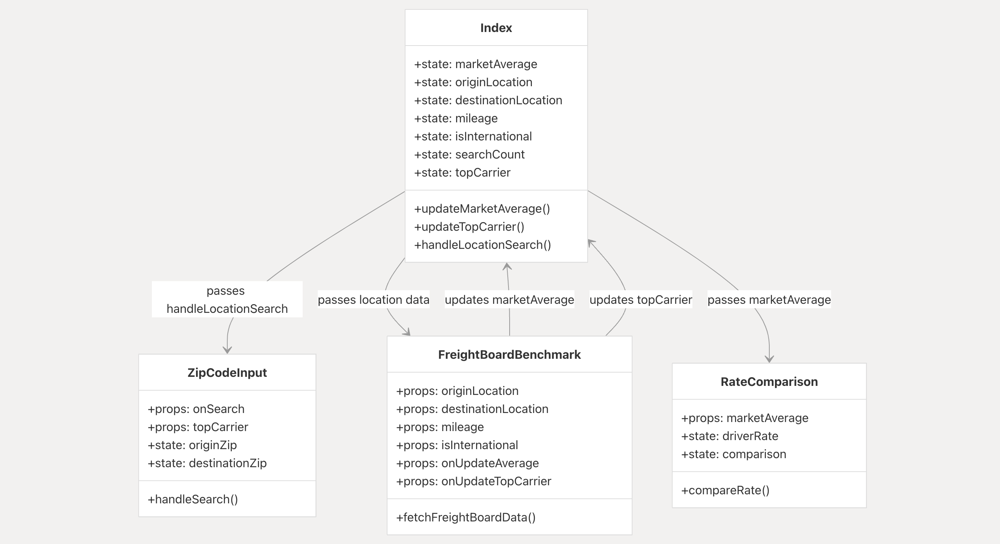

# Freight Fairness Finder

Detailed website explanation may be found at: https://deepwiki.com/nbergeland/freight-fairness-finder/1-overview#overview

## Project Overview

The Freight Fairness Finder is a React-based web application designed to help freight carriers and shippers compare rates across multiple freight boards and benchmark their rates against market averages. This document provides a high-level overview of the system architecture, core components, and data flow within the application.

# System Architecture

This page documents the overall architecture of the Freight Fairness Finder application, detailing its component structure, data flow patterns, and the relationships between different systems. 

## 1. High Level Arcitecture
The Freight Fairness Finder is built as a single-page React application with a component-based architecture. The application follows a layered design pattern with clear separation between the user interface, business logic, and data access layers.

# Application Layers

# Core System Components

## 2. Component Architecture

The application is structured around three main functional components, orchestrated by the Index page which serves as the main container and state manager.

# Main Components and Responsibilities
Component	Primary Responsibility	Data Handled
Index Page	Central state management and component orchestration	Manages search state, location data, market rates
ZipCodeInput	User input for locations and distance calculation	Origin/destination locations, mileage data
FreightBoardBenchmark	Fetches and displays freight rate benchmarks	Freight board rates, carrier data
RateComparison	Allows users to compare rates against market	User rate input, comparison results

# Component Relationships Diagram

## Key Features

1. **Zip Code to Zip Code Search**: Users can input origin and destination zip codes to calculate estimated mileage for their route.

2. **Freight Board Benchmark**: The app fetches and displays average rates from multiple freight boards, including:
   - DAT
   - Truckstop.com
   - Freightos
   - LoadPilot
   - 123LoadBoard
   - FreightWaves SONAR
   - uShip
   - Getloaded.com

3. **Rate Comparison**: Users can compare their own rates against the calculated market average.

4. **Mileage Calculation**: The app uses the MapQuest API to calculate accurate mileage between zip codes.

5. **Total Cost Estimation**: Based on the mileage and average rates, the app provides estimated total costs for each freight board.

## Technology Stack

- React
- Vite
- Tailwind CSS
- shadcn/ui components
- React Query for data fetching
- MapQuest API for geocoding and distance calculation

## Setup and Installation

1. Clone the repository
2. Install dependencies: `npm install`
3. Replace `YOUR_MAPQUEST_API_KEY` in `src/components/FreightBoardBenchmark.jsx` and `src/components/ZipCodeInput.jsx` with your actual MapQuest API key
4. Run the development server: `npm run dev`

## Usage

1. Enter origin and destination zip codes in the Zip Code Input section
2. View the calculated mileage and freight board benchmarks
3. Enter your own rate in the Rate Comparison section to see how it compares to the market average

## Deployment

To deploy the Freight Fairness Finder to a website, follow these steps:

1. Build the project:
   Run `npm run build` in the project directory. This will create a `dist` folder with the production-ready files.

2. Choose a hosting service:
   Select a hosting service for static websites. Popular options include:
   - Netlify
   - Vercel
   - GitHub Pages

3. Deploy the built files:
   - For Netlify or Vercel: Connect your GitHub repository and follow their deployment instructions.
   - For GitHub Pages: Push the contents of the `dist` folder to a `gh-pages` branch in your repository.

4. Configure your domain:
   Set up a custom domain if desired, following the instructions provided by your chosen hosting service.

## Contributing

Contributions are welcome! Please feel free to submit a Pull Request.

## License

This project is open source and available under the [MIT License](LICENSE).
